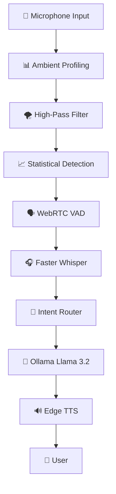
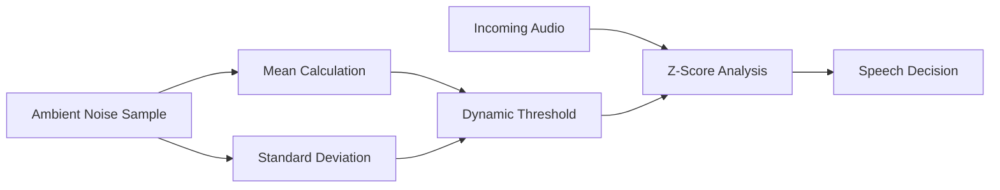
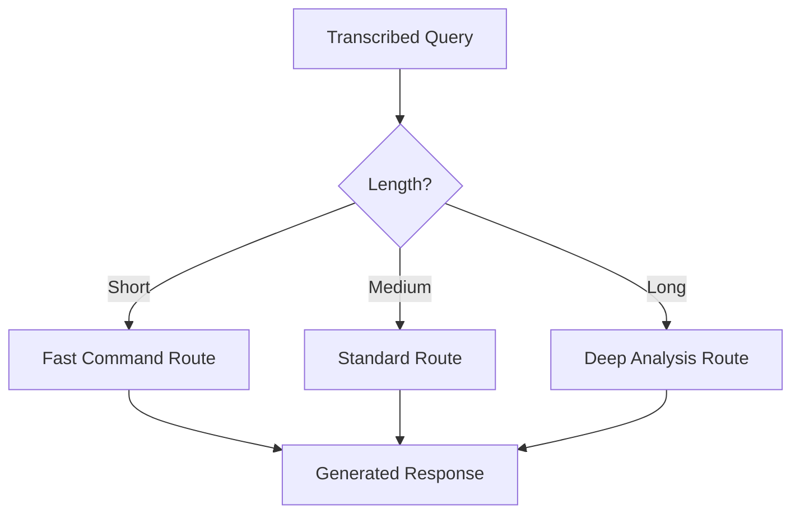

# 🎙️ Jarvis — Statistical Voice Assistant

<div align="center">


### A Real-Time, Statistical, Local-First Voice Assistant Built for Noisy Environments

*Eliminating ghost triggers through signal processing, statistical modeling, and local AI inference.*

</div>

---

## ✨ Why Jarvis Exists

Most voice assistants make a simple assumption:

> "If audio is loud enough, it's probably speech."

That assumption breaks down in the real world.

Ceiling fans, coolers, HVAC systems, electrical microphone noise, and environmental rumble often generate enough energy to trigger false activations.

Jarvis takes a different approach.

Instead of asking:

> "Is the signal loud?"

Jarvis asks:

> **"Is this signal statistically unlikely to be ambient noise?"**

The result is a voice assistant that is significantly more resistant to false positives while remaining responsive to actual human speech.

---

# 🚀 Features

## 📊 Dynamic Room Profiling

At startup, Jarvis builds an acoustic fingerprint of its environment.

- Measures ambient noise levels
- Calculates mean and standard deviation
- Learns room-specific characteristics
- Eliminates hardcoded sensitivity thresholds

---

## 🌪 High-Pass Wind Filtering

Uses differential signal processing:

```python
np.diff(audio_signal)
```

Benefits:

- Removes low-frequency fan rumble
- Suppresses environmental hum
- Preserves speech-related transients
- Reduces hardware interference

---

## 📈 Statistical Speech Detection

Speech activation is determined using Z-Score modeling.

Trigger gate:

```text
Threshold = Mean + (4 × Standard Deviation)
```

Advantages:

- Adaptive sensitivity
- Environment-aware activation
- Extremely low false-positive rate
- No manual calibration required

---

## 🧠 Multi-Tier Inference Routing

Jarvis dynamically selects processing strategies based on request complexity.

| Request Type | Routing Strategy |
|-------------|-----------------|
| Short commands | Fast context path |
| Medium requests | Standard reasoning |
| Long prompts | Full analytical pipeline |

This improves responsiveness without sacrificing reasoning quality.

---

## 🔒 Local-First Privacy

All critical AI components execute locally.

- Faster-Whisper for Speech-to-Text
- Ollama for LLM inference
- Edge-TTS for speech synthesis

No cloud dependency is required.

---

## 📡 Telemetry Bridge

Runtime diagnostics are continuously exported.

```text
diagnostics.json
```

Supports:

- Monitoring dashboards
- Performance analytics
- Acoustic calibration tracking
- Hardware health visualization

---

# 🏗 System Architecture

## High-Level Architecture



---

## Audio Authentication Pipeline



---

## Inference Routing Logic



---

# 🛠 Technology Stack

| Layer | Technology |
|---------|------------|
| Language | Python 3.11 |
| Audio Capture | PyAudio |
| Signal Processing | NumPy |
| Voice Activity Detection | WebRTC VAD |
| Speech Recognition | Faster-Whisper |
| Local LLM | Ollama (Llama 3.2) |
| Speech Synthesis | Edge-TTS |
| Telemetry | JSON |
| Automation | CLI Executor |

---

# 📦 Installation

## Prerequisites

- Linux (Ubuntu Recommended)
- Python 3.11+
- FFmpeg
- Ollama
- Microphone Access

### Clone Repository

```bash
git clone https://github.com/your-username/jarvis.git
cd jarvis
```

### Create Environment

```bash
python -m venv venv
source venv/bin/activate
```

### Install Dependencies

```bash
pip install -r requirements.txt
```

### Install LLM

```bash
ollama pull llama3.2
```

---

# ▶️ Usage

Start Jarvis:

```bash
python main.py
```

Startup Process:

```text
1. Ambient Calibration
2. Acoustic Fingerprinting
3. Statistical Threshold Computation
4. Listener Activation
5. Speech Processing Pipeline
6. Local AI Inference
7. Voice Response Generation
```

---

# 📂 Telemetry Output

Example:

```json
{
  "ambient_mean": 0.018,
  "ambient_std": 0.004,
  "trigger_threshold": 0.034,
  "speech_events": 52,
  "inference_latency_ms": 194
}
```

Useful for:

- Monitoring acoustic health
- Diagnosing microphone issues
- Tracking inference performance
- Feeding Next.js dashboards

---

# 🎯 Design Principles

### Privacy First

All AI workloads execute locally.

### Noise Resistant

Statistical detection instead of volume thresholds.

### Adaptive

Learns the environment automatically.

### Observable

Every important metric is measurable.

### Developer Friendly

Built with inspectable and extensible components.

---

# 🗺 Roadmap

- [ ] Wake-word engine
- [ ] Speaker recognition
- [ ] Long-term memory
- [ ] Multi-microphone beamforming
- [ ] GPU acceleration
- [ ] Web dashboard
- [ ] Edge deployment support
- [ ] Plugin ecosystem

---

# 🤝 Contributing

Contributions are welcome.

Areas of interest:

- Signal processing
- Low-latency AI systems
- Local LLM integrations
- Telemetry and observability
- Voice UX

---

# 📜 License

Distributed under the MIT License.

---

# ⭐ Acknowledgements

Built on top of outstanding open-source projects:

- Faster-Whisper
- Ollama
- NumPy
- WebRTC VAD
- Edge-TTS

---

<div align="center">

### Statistical Signal Processing Meets Local AI

**Jarvis isn't trying to hear everything.**
**It's trying to hear only what statistically matters.**

</div>
